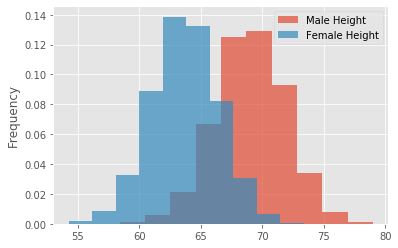
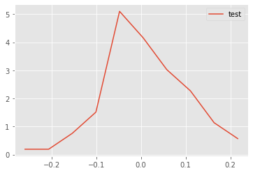
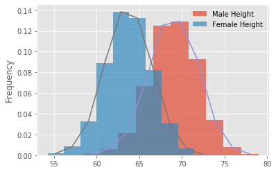
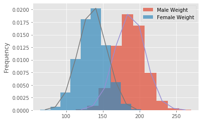
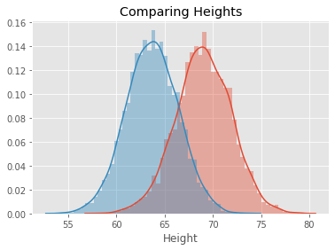
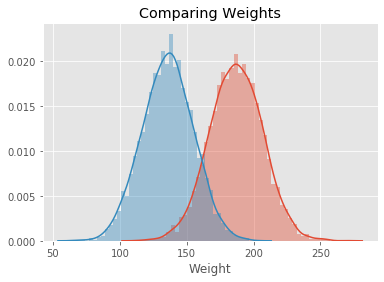

# The Probability Density Function - Lab

## Introduction
In this lab, we will look at building visualizations known as **density plots** to estimate the probability density for a given set of data. 

## Objectives

You will be able to:

* Plot and interpret density plots and comment on the shape of the plot
* Estimate probabilities for continuous variables by using interpolation 


## Let's get started

Let's import the necessary libraries for this lab.


```python
# Import required libraries
import numpy as np
import matplotlib.pyplot as plt
plt.style.use('ggplot')
import pandas as pd 
```

## Import the data, and calculate the mean and the standard deviation

- Import the dataset 'weight-height.csv' as a pandas dataframe.

- Next, calculate the mean and standard deviation for weights and heights for men and women individually. You can simply use the pandas `.mean()` and `.std()` to do so.

**Hint**: Use your pandas dataframe subsetting skills like `loc()`, `iloc()`, and `groupby()`


```python
data = pd.read_csv('weight-height.csv')
data.describe()
```


<div>
<style scoped>
    .dataframe tbody tr th:only-of-type {
        vertical-align: middle;
    }

    .dataframe tbody tr th {
        vertical-align: top;
    }

    .dataframe thead th {
        text-align: right;
    }
</style>
<table border="1" class="dataframe">
  <thead>
    <tr style="text-align: right;">
      <th></th>
      <th>Height</th>
      <th>Weight</th>
    </tr>
  </thead>
  <tbody>
    <tr>
      <td>count</td>
      <td>10000.000000</td>
      <td>10000.000000</td>
    </tr>
    <tr>
      <td>mean</td>
      <td>66.367560</td>
      <td>161.440357</td>
    </tr>
    <tr>
      <td>std</td>
      <td>3.847528</td>
      <td>32.108439</td>
    </tr>
    <tr>
      <td>min</td>
      <td>54.263133</td>
      <td>64.700127</td>
    </tr>
    <tr>
      <td>25%</td>
      <td>63.505620</td>
      <td>135.818051</td>
    </tr>
    <tr>
      <td>50%</td>
      <td>66.318070</td>
      <td>161.212928</td>
    </tr>
    <tr>
      <td>75%</td>
      <td>69.174262</td>
      <td>187.169525</td>
    </tr>
    <tr>
      <td>max</td>
      <td>78.998742</td>
      <td>269.989699</td>
    </tr>
  </tbody>
</table>
</div>


```python
data.head()
```


<div>
<style scoped>
    .dataframe tbody tr th:only-of-type {
        vertical-align: middle;
    }

    .dataframe tbody tr th {
        vertical-align: top;
    }

    .dataframe thead th {
        text-align: right;
    }
</style>
<table border="1" class="dataframe">
  <thead>
    <tr style="text-align: right;">
      <th></th>
      <th>Gender</th>
      <th>Height</th>
      <th>Weight</th>
    </tr>
  </thead>
  <tbody>
    <tr>
      <td>0</td>
      <td>Male</td>
      <td>73.847017</td>
      <td>241.893563</td>
    </tr>
    <tr>
      <td>1</td>
      <td>Male</td>
      <td>68.781904</td>
      <td>162.310473</td>
    </tr>
    <tr>
      <td>2</td>
      <td>Male</td>
      <td>74.110105</td>
      <td>212.740856</td>
    </tr>
    <tr>
      <td>3</td>
      <td>Male</td>
      <td>71.730978</td>
      <td>220.042470</td>
    </tr>
    <tr>
      <td>4</td>
      <td>Male</td>
      <td>69.881796</td>
      <td>206.349801</td>
    </tr>
  </tbody>
</table>
</div>


```python
male_df =  data.loc[data['Gender'] == 'Male']
female_df =  data.loc[data['Gender'] == 'Female']

print('Male Height mean:', male_df.Height.mean())
print('Male Height sd:', male_df.Height.std())
print('Male Weight mean:', male_df.Weight.mean())
print('Male Weight sd:', male_df.Weight.std())
print('Female Height mean:', female_df.Height.mean())
print('Female Height sd:', female_df.Height.std())
print('Female Weight mean:', female_df.Weight.mean())
print('Female Weight sd:', female_df.Weight.std())

# Male Height mean: 69.02634590621737
# Male Height sd: 2.8633622286606517
# Male Weight mean: 187.0206206581929
# Male Weight sd: 19.781154516763813
# Female Height mean: 63.708773603424916
# Female Height sd: 2.696284015765056
# Female Weight mean: 135.8600930074687
# Female Weight sd: 19.022467805319007
```

    Male Height mean: 69.02634590621741
    Male Height sd: 2.863362228660647
    Male Weight mean: 187.0206206581932
    Male Weight sd: 19.7811545167638
    Female Height mean: 63.70877360342507
    Female Height sd: 2.696284015765054
    Female Weight mean: 135.86009300746835
    Female Weight sd: 19.022467805319028


## Plot histograms (with densities on the y-axis) for male and female heights 

- Make sure to create overlapping plots
- Use binsize = 10, set alpha level so that overlap can be visualized


```python
binsize = 10
male_df.Height.plot.hist(bins=binsize, density=True, alpha=0.7, label='Male Height');
female_df.Height.plot.hist(bins=binsize, density=True, alpha=0.7, label='Female Height');
plt.legend()
plt.show()
```





**Record your observations - are these inline with your personal observations?**
    * Men tend to be taller than women
    * The most common heights for men and women ranges between 65 and 66 inches.
    * The height distribution for men and women is normal

## Create a density function using interpolation


- Write a density function density() that uses interpolation and takes in a random variable
- Use `np.histogram()`
- The function should return two lists carrying x and y coordinates for plotting the density function


```python
def density(x):
    
    n, bins = np.histogram(x, 10, density=1)
    # Initialize numpy arrays with zeros according to # bins to store interpolated values
    pdfx = np.zeros(n.size)
    pdfy = np.zeros(n.size)

    # Interpolate through histogram bins 
    # identify middle point between two neighbouring bins, in terms of x and y coords
    for k in range(n.size):
        pdfx[k] = 0.5*(bins[k]+bins[k+1])
        pdfy[k] = n[k]

    # plot the calculated curve
    return pdfx, pdfy


# Generate test data and test the function - uncomment to run the test
np.random.seed(5)
mu, sigma = 0, 0.1 # mean and standard deviation
s = np.random.normal(mu, sigma, 100)
x,y = density(s)
plt.plot(x,y, label = 'test')
plt.legend()
plt.show()
```





## Add overlapping density plots to the histograms plotted earlier


```python
male_df.Height.plot.hist(bins=binsize, density=True, alpha=0.7, label='Male Height');
female_df.Height.plot.hist(bins=binsize, density=True, alpha=0.7, label='Female Height');
plt.legend()
x,y = density(male_df.Height)
plt.plot(x,y)
x,y = density(female_df.Height)
plt.plot(x,y)
plt.show()
```





## Repeat the above exercise for male and female weights


```python
male_df.Weight.plot.hist(bins=binsize, density=True, alpha=0.7, label='Male Weight');
female_df.Weight.plot.hist(bins=binsize, density=True, alpha=0.7, label='Female Weight');
plt.legend()
x,y = density(male_df.Weight)
plt.plot(x,y)
x,y = density(female_df.Weight)
plt.plot(x,y)
plt.show()
```





## Write your observations in the cell below

Record your observations - are these inline with your personal observations?
What is the takeaway when comparing male and female heights and weights?

* Men tend to weigh more than women
* The most common weight range for both sexes is between 150-170
* There is less overlap between men and women for weight than there is for height.

## Repeat the above experiments in seaborn and compare with your results


```python
import seaborn as sns
sns.distplot(male_df.Height)
sns.distplot(female_df.Height)
plt.title('Comparing Heights')
plt.show()
```





```python
# Code for weights here
sns.distplot(male_df.Weight)
sns.distplot(female_df.Weight)
plt.title('Comparing Weights')
plt.show()
```





Your comments on the two approaches here. Are they similar? what makes them different if they are?

* Seaborn shows more detail as far as higher number of bins
* It also uses a more granular density curve rather than matplotlib's angular lines
* Less code required for Seaborn (more efficient approach)

## Summary

In this lesson, you learned how to build the probability density curves visually for a given dataset and compare the distributions visually by looking at the spread, center, and overlap. This is a useful EDA technique and can be used to answer some initial questions before embarking on a complex analytics journey.
